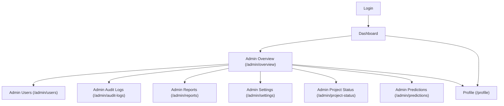

## 1. Product Overview
Split the Admin section into route-based pages (deep-linkable URLs) and consolidate profile management into one shared Profile page for all roles.
This improves navigation, bookmark/share support, and reduces duplicated UI/logic.

## 2. Core Features

### 2.1 User Roles
| Role | Registration Method | Core Permissions |
|------|---------------------|------------------|
| Authenticated User (any role) | Existing login flow | Can access the shared Profile page and role-allowed app pages |
| Admin | Existing login flow (role=ADMIN) | Can access all Admin routes plus shared Profile |

### 2.2 Feature Module
The requirements consist of the following main pages:
1. **Admin Overview**: admin dashboard summary.
2. **Admin Project Status**: project/inventory status table.
3. **Admin Predictions**: prediction runner and results table.
4. **Admin Users**: user list and user management actions.
5. **Admin Audit Logs**: audit log list and filters.
6. **Admin Reports**: reporting tables, export actions.
7. **Admin Settings**: company directory and other admin settings.
8. **Profile (shared)**: view/edit your profile, avatar upload/remove, clear profile.

### 2.3 Page Details
| Page Name | Module Name | Feature description |
|-----------|-------------|---------------------|
| Admin Overview | Route-based entry | Open via `/admin/overview`; preserve existing overview content and navigation. |
| Admin Project Status | Route-based page | Open via `/admin/project-status`; preserve existing tables/filters and URL-level navigation. |
| Admin Predictions | Route-based page | Open via `/admin/predictions`; preserve prediction workflows and loading/error states. |
| Admin Users | Route-based page | Open via `/admin/users`; preserve existing user management component behavior. |
| Admin Audit Logs | Route-based page | Open via `/admin/audit-logs`; preserve existing audit log component behavior. |
| Admin Reports | Route-based page | Open via `/admin/reports`; preserve existing report filters, pagination, and exports. |
| Admin Settings | Route-based page | Open via `/admin/settings`; preserve existing admin settings forms and persistence. |
| Profile (shared) | Single profile experience | Use `/profile` for all roles; remove the separate Admin-only profile view; allow optional redirect from `/admin/profile` to `/profile` for backward compatibility. |

## 3. Core Process
- Admin flow: Navigate to Admin routes via sidebar; each Admin section has its own URL that can be reloaded/bookmarked/shared; `/admin` redirects to `/admin/overview`.
- Profile flow (all users including Admin): Open `/profile`, update fields, upload/remove avatar, save changes, or clear profile.

