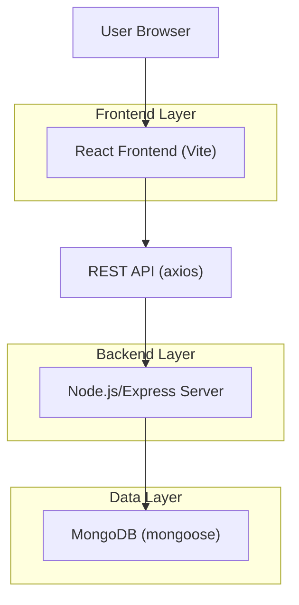

## 1.Architecture design

## 2.Technology Description
- Frontend: React@19 + react-router-dom@7 + tailwindcss@4 + vite + axios
- Backend: Node.js + Express@5
- Database: MongoDB (via mongoose)

## 3.Route definitions
| Route | Purpose |
|-------|---------|
| /login | Authenticate user |
| /dashboard | Main user landing page |
| /profile | **Shared profile page for all roles** |
| /admin | Redirect to /admin/overview (admin only) |
| /admin/overview | Admin dashboard summary (admin only) |
| /admin/project-status | Admin project/inventory status view (admin only) |
| /admin/predictions | Admin prediction tools (admin only) |
| /admin/users | Admin user management (admin only) |
| /admin/audit-logs | Admin audit log viewer (admin only) |
| /admin/reports | Admin reporting views (admin only) |
| /admin/settings | Admin settings (admin only) |
| /admin/profile | Optional redirect to /profile (admin only; backward compatible) |

## 4.API definitions (If it includes backend services)
No new APIs are required. Existing profile APIs remain the source of truth:
- GET /auth/profile
- PUT /auth/profile
- PUT /auth/profile/avatar
- DELETE /auth/profile/avatar
- DELETE /auth/profile

## 6.Data model(if applicable)
No schema changes required.

Implementation notes (frontend-only refactor):
- Replace the current tab-state-driven AdminPanel with an Admin Layout route using nested child routes (React Router) and an <Outlet>.
- Extract each tab section into its own page component (Overview, Project Status, Predictions, Users, Audit Logs, Reports, Settings).
- Update sidebar navigation to use route links (e.g., NavLink) so refresh/deep-links preserve the selected section.
- Remove AdminProfile usage; route all profile access to /profile and optionally add a redirect route for /admin/profile.