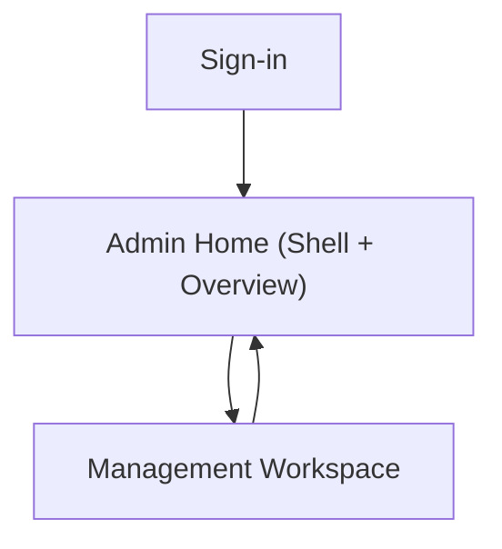

## 1. Product Overview
Modernize the admin panel UI/UX to make navigation clearer, visuals consistent, and the experience responsive and accessible.
This work focuses on information architecture, visual system, and interaction quality (not adding new business features).

## 2. Core Features

### 2.1 User Roles
| Role | Registration Method | Core Permissions |
|------|---------------------|------------------|
| Admin User | Existing admin authentication (SSO/email/etc.) | Can access admin panel modules according to existing permissions |

### 2.2 Feature Module
Our admin panel modernization consists of the following main pages:
1. **Sign-in**: clear authentication UI, error handling, accessible form controls.
2. **Admin Home (Shell + Overview)**: persistent navigation, consistent header tools, overview content area.
3. **Management Workspace**: reusable table/forms patterns, detail viewing/editing experience, responsive layout.

### 2.3 Page Details
| Page Name | Module Name | Feature description |
|-----------|-------------|---------------------|
| Sign-in | Form layout + validation | Present clear inputs and inline validation; show actionable errors; support password manager autofill and keyboard submit. |
| Sign-in | Accessibility | Provide proper labels, focus order, error announcements, and sufficient contrast for all states. |
| Admin Home (Shell + Overview) | Global navigation | Provide persistent sidebar/topbar navigation; indicate current location; support collapsed sidebar; include breadcrumbs where needed. |
| Admin Home (Shell + Overview) | Information hierarchy | Present a scannable overview area with consistent page titles, section headings, and key metrics/summary blocks (content driven by existing data). |
| Admin Home (Shell + Overview) | Responsive behavior | Adapt sidebar/topbar to smaller viewports (collapse/drawer); keep primary actions reachable without horizontal scrolling. |
| Admin Home (Shell + Overview) | System feedback | Standardize loading/empty/error states across modules; use consistent toasts/alerts with clear wording. |
| Management Workspace | Consistent data tables | Provide sorting/filtering/pagination UI patterns (as supported today); make columns readable; support sticky header; avoid layout jumps. |
| Management Workspace | Record details | Present record detail in a panel/page with clear sections; provide primary/secondary actions with consistent placement. |
| Management Workspace | Forms + input standards | Standardize field spacing, helper text, validation, disabled/read-only states; support keyboard navigation and clear error recovery. |
| Management Workspace | Accessibility + usability | Ensure focus visible, ARIA for tables/modals, dialog trapping, logical tab order, and minimum hit targets. |

## 3. Core Process
**Admin Flow**
1. Open the admin URL and sign in.
2. Land on Admin Home with a clear global navigation shell.
3. Use navigation to enter a management area.
4. In the workspace, browse records via table patterns, open a record, and perform allowed actions.
5. Receive consistent feedback (loading, success, error) and continue navigation without losing context.

