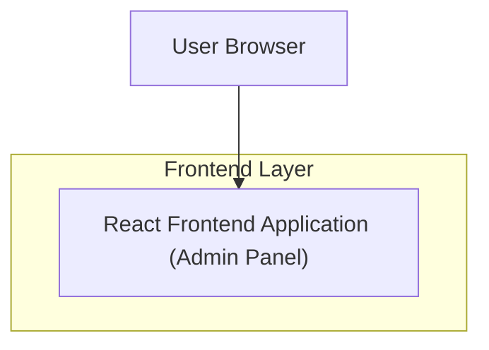

## 1.Architecture design

## 2.Technology Description
- Frontend: React@18 + TypeScript + vite
- Styling: tailwindcss@3 (or equivalent token-based CSS system)
- UI Patterns: Headless accessible components (e.g., Radix UI / Headless UI) for dialogs/menus
- State/Data: TanStack Query (or equivalent) for request caching; React Hook Form for forms
- Backend: None (UI/UX modernization only; existing data APIs remain as-is)

## 3.Route definitions
| Route | Purpose |
|-------|---------|
| /login | Sign-in page and authentication error handling |
| /app | Admin shell landing (overview) |
| /app/workspace | Management workspace (table + detail + forms patterns) |

## 4.API definitions (If it includes backend services)
N/A (no new backend services introduced).

## 5.Server architecture diagram (If it includes backend services)
N/A.

## 6.Data model(if applicable)
N/A (no new database or data model changes required for UI/UX modernization).